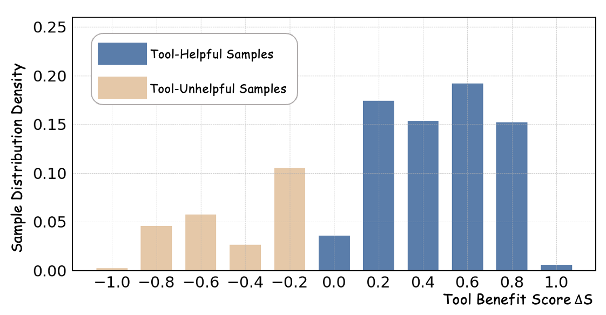

# AdaTooler-V: Adaptive Tool-Use for Images and Videos

[[📖 Paper](https://arxiv.org/pdf/2512.16918)] [[🤗 AdaTooler-V-7B-model](https://huggingface.co/AdaTooler-V/AdaTooler-V-7B)] 
[[🤗 AdaTooler-V-SFT-model](https://huggingface.co/AdaTooler-V/AdaTooler-V-SFT-model)] 
[[🤗 AdaTooler-V-train-data](https://huggingface.co/datasets/AdaTooler-V/AdaTooler-V-300k)] [[🤗 AdaTooler-V-eval](https://huggingface.co/datasets/AdaTooler-V/AdaTooler-V-eval)]


## 👀 About AdaTooler-V
We propose **AdaTooler-V**, an MLLM that **performs adaptive tool-use by determining whether a visual problem truly requires tools.**

First, we introduce **AT-GRPO**, a reinforcement learning algorithm that adaptively adjusts reward scales based on the Tool Benefit Score of each sample, encouraging the model to invoke tools only when they provide genuine improvements.

Moreover, we construct two datasets to support training: **AdaTooler-V-CoT-100k** for SFT cold start and **AdaTooler-V-300k** for RL with verifiable rewards across single-image, multi-image, and video data.

Experiments across twelve benchmarks demonstrate the strong reasoning capability of AdaTooler-V, outperforming existing methods in diverse visual reasoning tasks. Notably, AdaTooler-V-7B achieves an accuracy of 89.8\% on the high-resolution benchmark V*, **surpassing the
commercial proprietary model GPT-4o and Gemini 1.5 Pro.**

<div align="center">
  
</div>

## 📝 TODO
- [ ] Release the eval data
- [ ] Release the Traing data
- [ ] Release the Models

## 🔍 Dataset

To support adaptive tool-use learning across multiple modalities, we construct two large-scale datasets for different training stages: AdaTooler-V-CoT-100k for SFT Cold start and AdaTooler-V-300k for RL.


To facilitate effective initialization during the SFT stage, we leverage Qwen2.5-VL-72B-Instruct to automatically produce Chain-of-Thought (CoT) rationales for all samples in AdaTooler-V-300k. Following generation, we apply a sequence of rule-based filtering procedures to eliminate low-quality or semantically inconsistent outputs. This process yields a high-fidelity corpus, AdaTooler-V-CoT-100k.

## 🏆 Performance
AdaTooler-V-7B achieves superior performance on a wide range of image and video reasoning benchmarks.


<div align="center">

</div>


AdaTooler-V-7B achieves a **+11.3% absolute improvement on V*** over the base model and shows **consistent gains across general and high-resolution benchmarks**, demonstrating strong cross-domain generalization and robust multi-image spatial reasoning ability.

<div align="center">

</div>

AdaTooler-V significantly outperforms the base model, achieving a **+11.3% gain on V*** and consistent improvements across multiple benchmarks, demonstrating strong generalization and effective multi-image spatial reasoning.


## 🧠 Some Reasoning Examples of AdaTooler-V-7B

<div align="center">
  
</div>

<div align="center">
  
</div>


## 📈 RL Training Curves

During the reinforcement learning stage, the model’s accuracy steadily increases, indicating effective policy optimization with AT-GRPO. Meanwhile, the average response length drops rapidly in the early phase and then stabilizes, showing that the model quickly eliminates unnecessary tool usage while maintaining a balance between concise reasoning and necessary tool interactions.


<div align="center">
  
</div>


## 📐 Set up
```
cd verltool
git submodule update --init --recursive
conda create --name verl-tool-env python=3.10
conda activate verl-tool-env
pip install -e verl
pip install -e ".[vllm,acecoder,torl,search_tool]"
pip install "flash-attn==2.8.3" --no-build-isolation
```

## 🚀 Training
### Stage 1: Cold-start Supervised Fine-tuning (SFT)

We recommend to use the popular [LLaMA-Factory](https://github.com/hiyouga/LLaMA-Factory) to perform SFT on our cold-start data.
1. Install [LLaMA-Factory](https://github.com/hiyouga/LLaMA-Factory).
2. Use the script `scripts/preprocess_coldstart.py` to download [AdaTooler-V-CoT-100k](ChaoyangWang/AdaTooler-V-CoT-100k) and produce the required data format by LLaMA-Factory. This script automatically extracts images and generates a JSON file from the original parquet-format dataset.
```
python3 scripts/preprocess_coldstart.py --dataset_path ChaoyangWang/AdaTooler-V-CoT-100k --output_dir [YOUR_DATASET_FOLDER]
```
3. After processing, please follow the instructions in LLaMA-Factory to configure the cold-start data in `data/dataset_info.json`, as shown below, then copy the config file `sft_configs/qwen2.5-vl.yaml` into your LLaMA-Factory codebase.
```
"AdaTooler-V-CoT-100k": {
  "file_name": "[YOUR_DATASET_FOLDER]/AdaTooler-V-CoT-100k.json",
  "formatting": "sharegpt",
  "columns": {
    "messages": "conversations",
    "images": "images"
  },
  "tags": {
    "role_tag": "from",
    "content_tag": "value",
    "user_tag": "human",
    "assistant_tag": "gpt",
    "system_tag": "system"
  }
}
```
4. Train Cold-start data with the training configs.
```
llamafactory-cli train sft_configs/qwen2.5-vl.yaml
```

### Stage 2: Reinforcement Learning (RL)
```
cd verltool
bash examples/train/AdaTooler-V/train_qwen25vl.sh
```
It should be able to run under 8 H100/A100 GPUs with 80GB memory. 

Tips:
- if output shared memory, try lower the `data.dataloader_num_workers`
- if out of cuda memory during vllm rollout, try set `actor_rollout_ref.rollout.enforce_eager=True`, might be slower.
- if out of cuda memory during training, try lower the `use_dynamic_bs=False`.

## 🔮 Evaluation
```
cd verltool
bash examples/train/AdaTooler-V/eval.sh
```

## Acknowledgements

We sincerely appreciate the contributions of the open-source community. The related projects are as follows: [verl-tool](https://github.com/TIGER-AI-Lab/verl-tool) , [LLaMA-Factory](https://github.com/hiyouga/LLaMA-Factory) 

## Citations

If you find our work helpful for your research, please consider citing our work.   

```
@article{wang2025adatooler,
  title={AdaTooler-V: Adaptive Tool-Use for Images and Videos},
  author={Wang, Chaoyang and Feng, Kaituo and Chen, Dongyang and Wang, Zhongyu and Li, Zhixun and Gao, Sicheng and Meng, Meng and Zhou, Xu and Zhang, Manyuan and Shang, Yuzhang and others},
  journal={arXiv preprint arXiv:2512.16918},
  year={2025}
}
```
