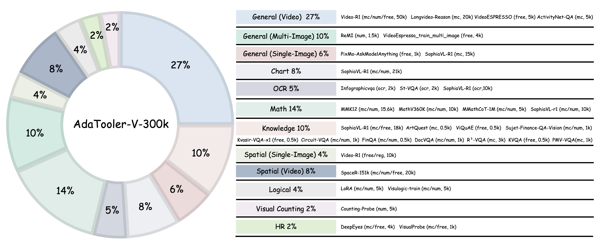
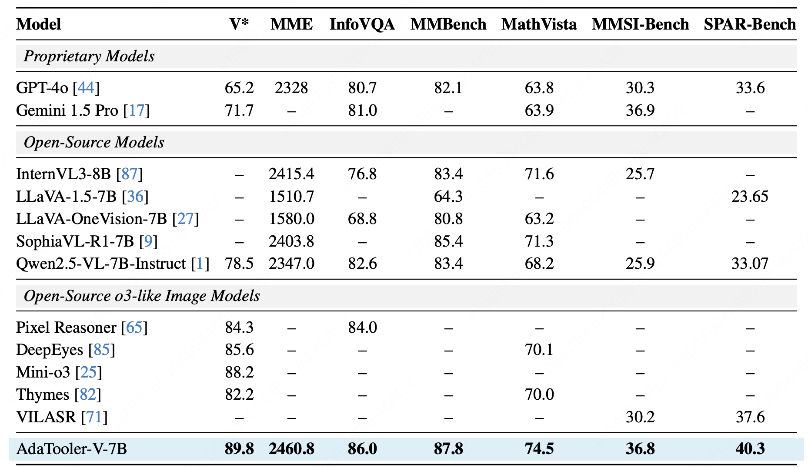
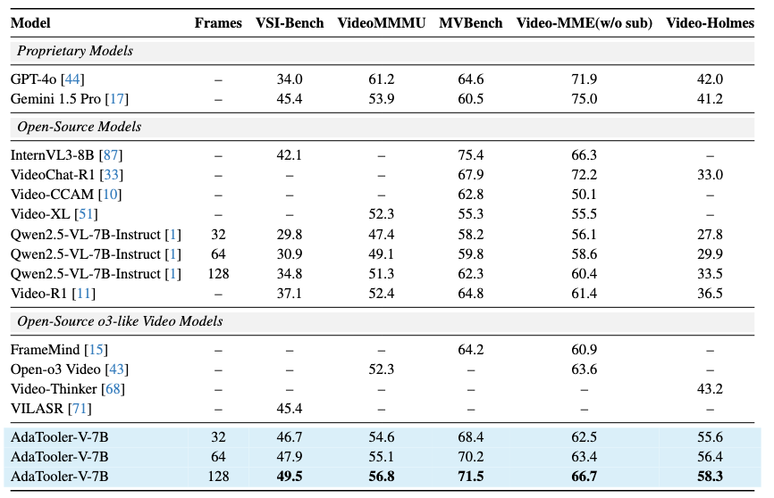
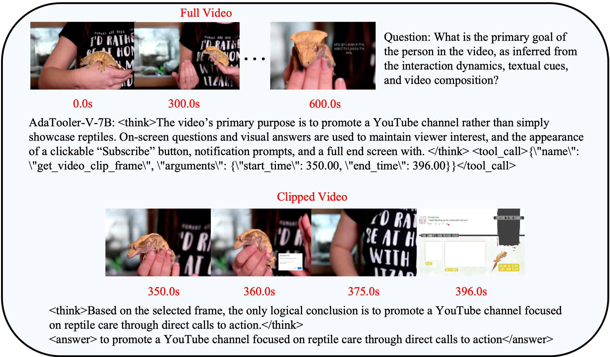
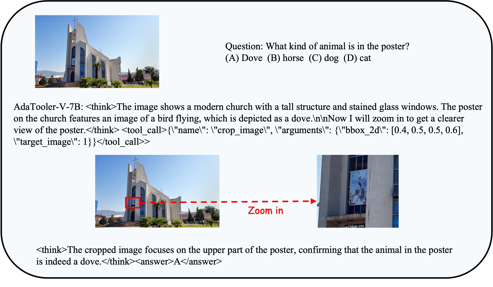

# AdaTooler-V: Adaptive Tool-Use for Images and Videos

[[📖 Paper](https://arxiv.org/pdf/2503.21776)] [[🤗 AdaTooler-V-7B-model](https://huggingface.co/ChaoyangWang/AdaTooler-V-7B)] 
[[🤗 AdaTooler-V-SFT-model](ChaoyangWang/Qwen2.5-VL-7B-CoT-SFT)] 
[[🤗 AdaTooler-V-train-data](https://huggingface.co/datasets/ChaoyangWang/AdaTooler-V-300k)] [[🤗 AdaTooler-V-eval](ChaoyangWang/AdaTooler-V-eval)]

## 👀 About AdaTooler-V
We propose **AdaTooler-V**, an MLLM that **performs adaptive tool-use by determining whether a visual problem truly requires tools.**

First, we introduce **AT-GRPO**, a reinforcement learning algorithm that adaptively adjusts reward scales based on the Tool Benefit Score of each sample, encouraging the model to invoke tools only when they provide genuine improvements.

Moreover, we construct two datasets to support training: **AdaTooler-V-CoT-100k** for SFT cold start and **AdaTooler-V-300k** for RL with verifiable rewards across single-image, multi-image, and video data.

Experiments across twelve benchmarks demonstrate the strong reasoning capability of AdaTooler-V, outperforming existing methods in diverse visual reasoning tasks. Notably, AdaTooler-V-7B achieves an accuracy of 89.8\% on the high-resolution benchmark V*, **surpassing the
commercial proprietary model GPT-4o and Gemini 1.5 Pro.**

## 🔍 Dataset

To support adaptive tool-use learning across multiple modalities, we construct two large-scale datasets for different training stages: AdaTooler-V-CoT-100k for SFT Cold start and AdaTooler-V-300k for RL.

To facilitate effective initialization during the SFT stage, we leverage Qwen2.5-VL-72B-Instruct to automatically produce Chain-of-Thought (CoT) rationales for all samples in AdaTooler-V-300k. Following generation, we apply a sequence of rule-based filtering procedures to eliminate low-quality or semantically inconsistent outputs. This process yields a high-fidelity corpus, AdaTooler-V-CoT-100k.

## 🏆 Performance
AdaTooler-V-7B achieves superior performance on a wide range of image and video reasoning benchmarks.

AdaTooler-V-7B achieves a **+11.3% absolute improvement on V*** over the base model and shows **consistent gains across general and high-resolution benchmarks**, demonstrating strong cross-domain generalization and robust multi-image spatial reasoning ability.

AdaTooler-V significantly outperforms the base model, achieving a **+11.3% gain on V*** and consistent improvements across multiple benchmarks, demonstrating strong generalization and effective multi-image spatial reasoning.

## 🧠 Aha Moment in Video Reasoning
## 🧠 Some Reasoning Examples of SophiaVL-R1

One of the most intriguing outcomes of reinforcement learning in Video-R1 is the emergence of self-reflection reasoning behaviors, commonly referred to as “aha moments”. Some examples are as follows.

## 📈 RL Training Curves

During the reinforcement learning stage, the model’s accuracy steadily increases, indicating effective policy optimization with AT-GRPO. Meanwhile, the average response length drops rapidly in the early phase and then stabilizes, showing that the model quickly eliminates unnecessary tool usage while maintaining a balance between concise reasoning and necessary tool interactions.

## Acknowledgements

We sincerely appreciate the contributions of the open-source community. The related projects are as follows: [verl-tool](https://github.com/TIGER-AI-Lab/verl-tool) , [LLaMA-Factory](https://github.com/hiyouga/LLaMA-Factory) 
